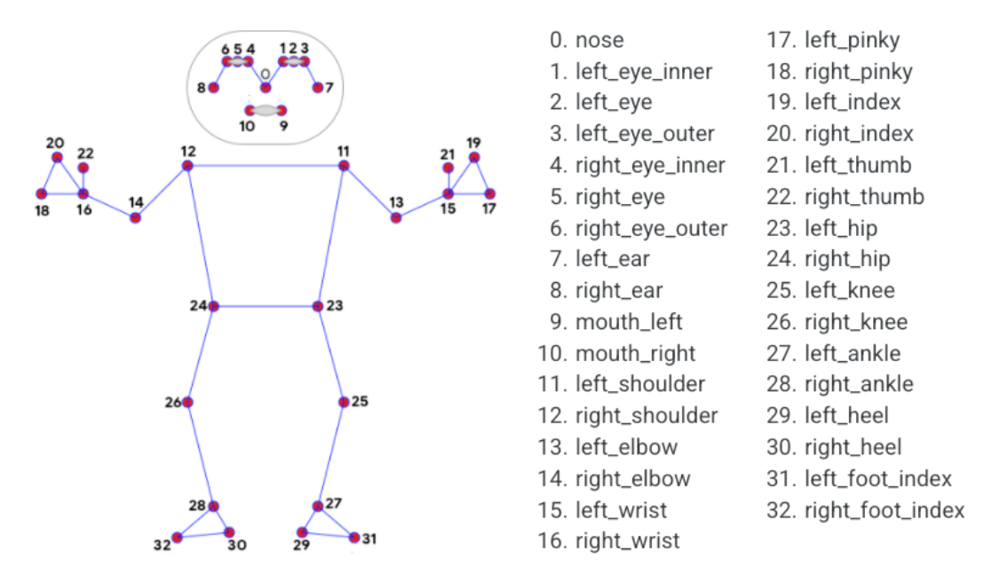

# Pose Estimation

A rep counter for squats that I created based off mediapipe by Google because I was interested in motion tracking without sensors

## Tracked points

Taken from Google Mediapipe docs

